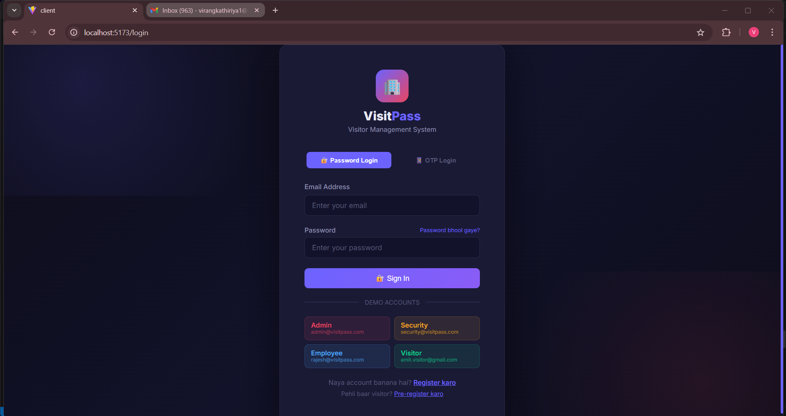
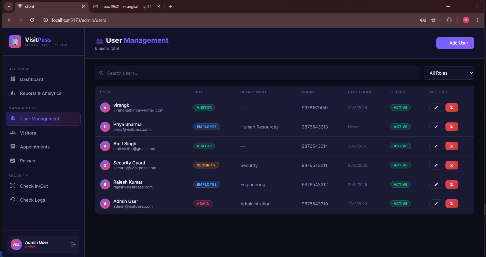
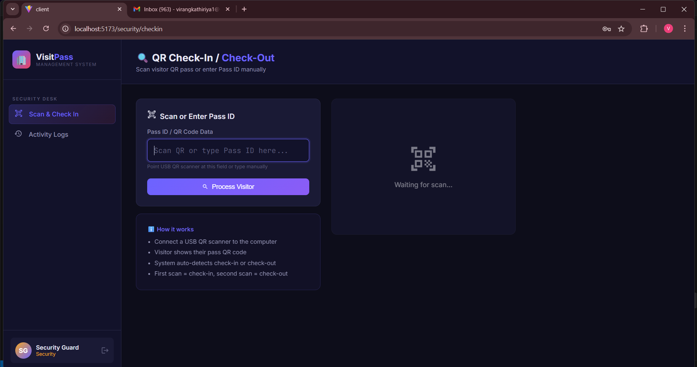
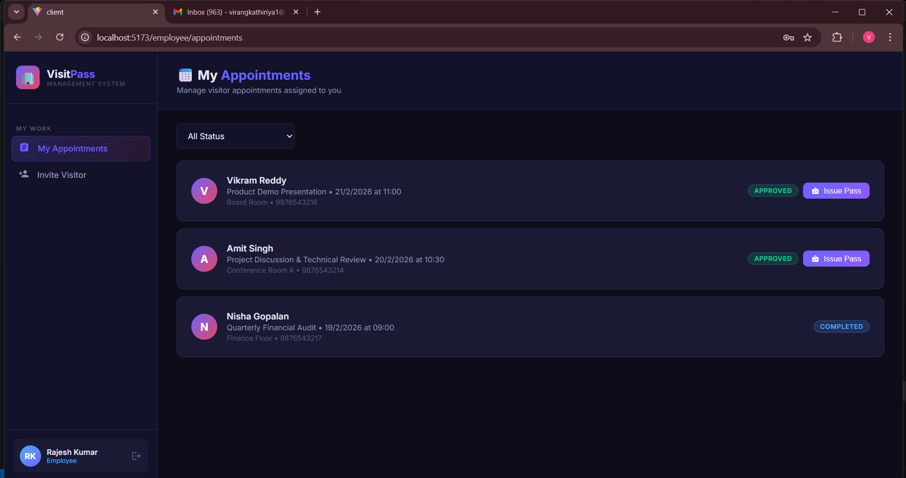
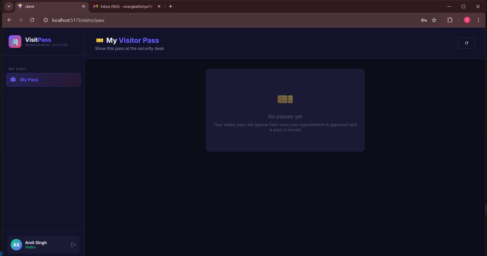

#  VisitPass — Visitor Pass Management System

A complete **MERN stack** Visitor Pass Management System with QR code based passes, role-based access control, PDF badge generation, and real-time check-in/out tracking.


##  Demo Video

<video src="screenshots/demo-video.mp4" controls width="100%"></video>

> **📥 [Click here to Download & Watch Demo](https://github.com/Virang41/visiting-/raw/main/screenshots/demo-video.mp4)**


##  Screenshots

###  Authentication
| Password Login | OTP Login |
|---|---|
|  |  |

###  Admin Panel
| Dashboard | Reports & Analytics |
|---|---|
|  |  |

| User Management | Visitors List |
|---|---|
|  |  |

| Appointments | Passes |
|---|---|
|  |  |

###  Security Desk
| QR Check-In/Out | Check-In/Out Logs |
|---|---|
|  |  |

| Security View |
|---|
|  |

###  Employee & Visitor
| Employee Appointments | Visitor Pass |
|---|---|
|  |  |


##  Features

| Feature | Details |
|--------|---------|
|  JWT Auth | Role-based: Admin, Security, Employee, Visitor |
|  Visitor Registration | Name, photo, ID verification |
|  Appointments | Invite, approve/reject, notify via email |
|  Digital Pass | QR code + PDF badge generation |
|  QR Check-In/Out | Smart scan with auto-toggle |
|  Email Notifications | Invite + status update emails |
|  Analytics Dashboard | Charts, stats, visitor trends |
|  CSV Export | Export visitor reports |


##  User Roles & Demo Accounts

| Role | Email | Password |
|------|-------|----------|
| Admin | admin@visitpass.com | Admin@123 |
| Security | security@visitpass.com | Security@123 |
| Employee | rajesh@visitpass.com | Employee@123 |
| Visitor | amit.visitor@gmail.com | Visitor@123 |


##  Setup Guide

### Prerequisites
- Node.js v18+
- MongoDB (local or Atlas)
- npm or yarn

### 1. Clone & Setup Backend

```bash
cd "visiting pass/server"
npm install
```

Create `.env` file (already exists, update MongoDB URI if needed):
```env
MONGODB_URI=mongodb://localhost:27017/visitor_pass_db
JWT_SECRET=visitor_pass_super_secret_key_2024_secure
PORT=5000
EMAIL_USER=your_email@gmail.com
EMAIL_PASS=your_app_password
CLIENT_URL=http://localhost:5173
```

### 2. Seed Demo Data

```bash
npm run seed
```

This creates all demo users, visitors, appointments, passes, and check logs.

### 3. Start Backend

```bash
npm run dev
# Server runs on http://localhost:5000
```

### 4. Setup Frontend

```bash
cd "../client"
npm install
npm run dev
# Client runs on http://localhost:5173
```

### 5. Open Browser

Visit **http://localhost:5173** and login with any demo account above.


##  Project Structure


visiting pass/
├── server/                    # Express + MongoDB Backend
│   ├── config/db.js           # MongoDB connection
│   ├── middleware/
│   │   ├── auth.js            # JWT verify + role guard
│   │   └── upload.js          # Multer photo upload
│   ├── models/
│   │   ├── User.js            # Admin/Security/Employee/Visitor
│   │   ├── Visitor.js         # Visitor profiles + ID
│   │   ├── Appointment.js     # Scheduling + approval
│   │   ├── Pass.js            # QR code passes
│   │   └── CheckLog.js        # Check-in/out events
│   ├── routes/
│   │   ├── auth.js            # Login, register, profile
│   │   ├── users.js           # User management (admin)
│   │   ├── visitors.js        # Visitor CRUD + photo
│   │   ├── appointments.js    # Booking + approval
│   │   ├── passes.js          # Issue, QR, PDF
│   │   ├── checkins.js        # QR scan events
│   │   └── dashboard.js       # Analytics + export
│   ├── services/
│   │   ├── emailService.js    # Nodemailer HTML emails
│   │   ├── qrService.js       # QR code generator
│   │   └── pdfService.js      # PDF badge generator
│   ├── seed.js                # Demo data seeder
│   └── server.js              # Express entry point
│
└── client/                    # React + Vite Frontend
    └── src/
        ├── api/axios.js        # Axios + JWT interceptor
        ├── context/
        │   └── AuthContext.jsx # Login/logout state
        ├── components/
        │   └── Sidebar.jsx     # Role-aware nav sidebar
        └── pages/
            ├── Login.jsx
            ├── admin/          # Dashboard, Users, Reports
            ├── security/       # CheckIn, CheckLog
            ├── employee/       # InviteVisitor, MyAppointments
            ├── visitor/        # MyPass, PreRegister
            └── shared/         # VisitorList, PassList, AppointmentList


##  API Endpoints

### Auth
| Method | Endpoint | Description |
|--------|----------|-------------|
| POST | `/api/auth/login` | Login → returns JWT |
| POST | `/api/auth/register` | Create account |
| GET | `/api/auth/me` | Get current user |

### Visitors
| Method | Endpoint | Description |
|--------|----------|-------------|
| GET | `/api/visitors` | List all visitors |
| POST | `/api/visitors` | Register visitor (+ photo upload) |
| PUT | `/api/visitors/:id` | Update visitor |

### Appointments
| Method | Endpoint | Description |
|--------|----------|-------------|
| GET | `/api/appointments` | List appointments (role-filtered) |
| POST | `/api/appointments` | Create appointment |
| PUT | `/api/appointments/:id/status` | Approve/reject |

### Passes
| Method | Endpoint | Description |
|--------|----------|-------------|
| POST | `/api/passes/issue/:appointmentId` | Issue QR pass |
| GET | `/api/passes/:id/pdf` | Download PDF badge |
| GET | `/api/passes/verify/:passId` | Verify pass for QR scan |
| PUT | `/api/passes/:id/revoke` | Revoke pass |

### Check-In/Out
| Method | Endpoint | Description |
|--------|----------|-------------|
| POST | `/api/checkins/scan` | QR scan → check-in or check-out |
| GET | `/api/checkins` | Get check logs |
| GET | `/api/checkins/today` | Today's logs |

### Dashboard
| Method | Endpoint | Description |
|--------|----------|-------------|
| GET | `/api/dashboard/stats` | Analytics & charts data |
| GET | `/api/dashboard/export` | Export CSV report |


##  Database Collections

| Collection | Purpose |
|----------|---------|
| `users` | All system users by role |
| `visitors` | Visitor profiles with ID & photo |
| `appointments` | Visit scheduling & approval |
| `passes` | QR-coded visitor passes |
| `checklogs` | Check-in/out audit trail |


##  Evaluation Checklist

-  **Functionality (40)** — All features implemented
-  **Code Quality (20)** — Modular, documented, clean
-  **UI/UX (20)** — Premium dark theme, responsive design
-  **Extra Features (10)** — Audit logs, CSV export, PDF badge
-  **Presentation (10)** — This README + seed script

---


