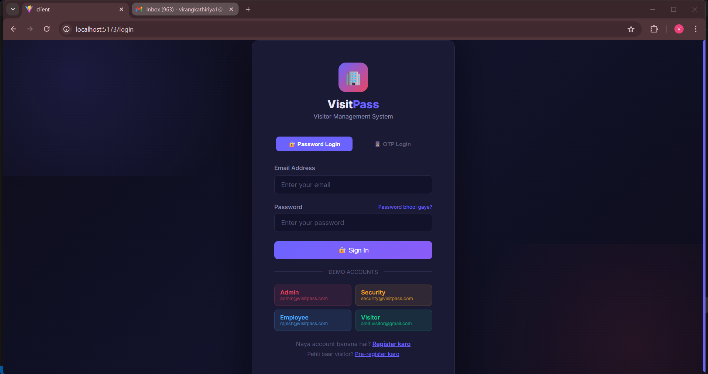
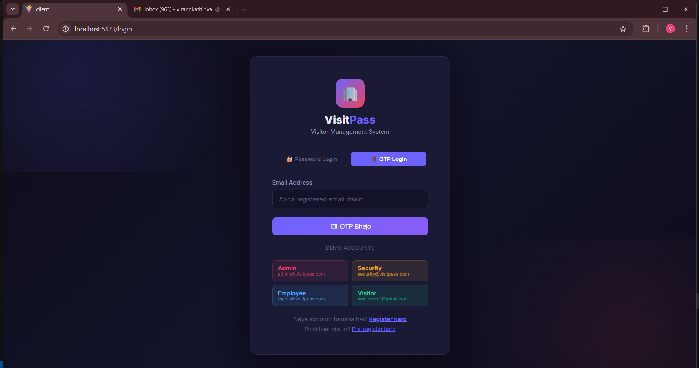
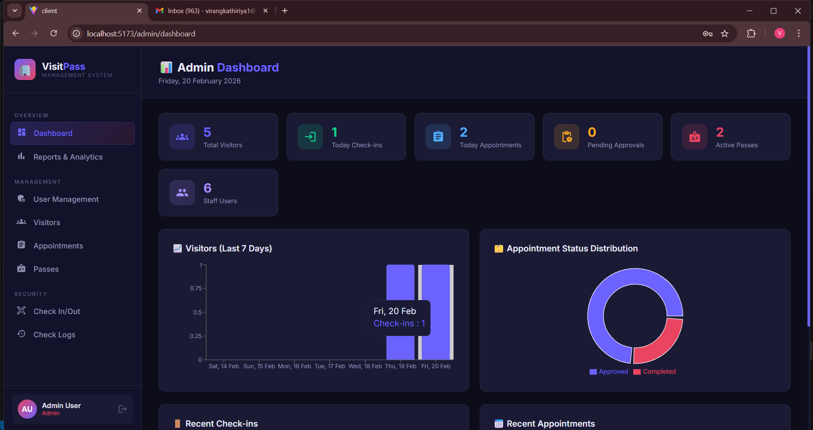
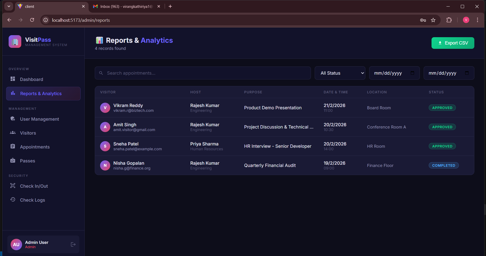
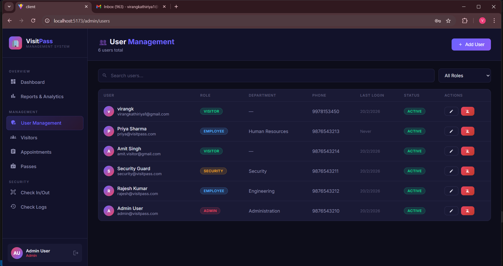
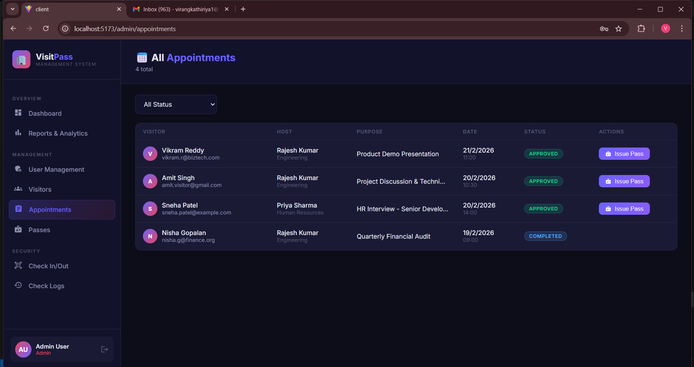
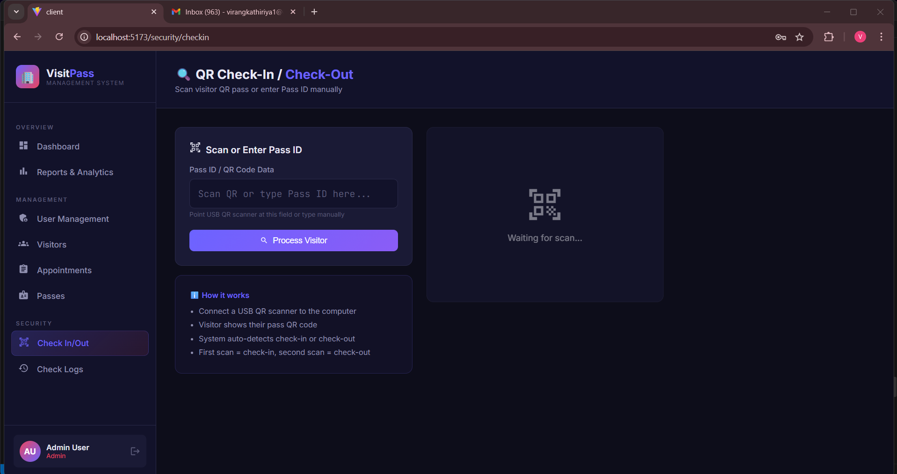
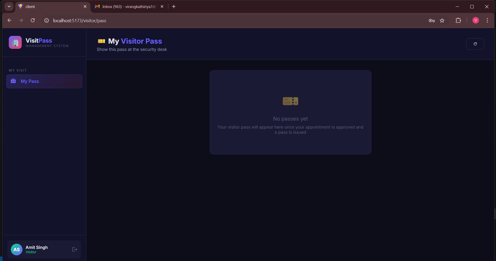

# VisitPass - Visitor Pass Management System

Yeh ek MERN stack project hai jisme QR code based visitor passes, role based login, aur real-time check-in/out system hai. Maine yeh college assignment ke liye banaya hai.

---

## Demo Accounts

| Role | Email | Password |
|------|-------|----------|
| Admin | admin@visitpass.com | Admin@123 |
| Security | security@visitpass.com | Security@123 |
| Employee | rajesh@visitpass.com | Employee@123 |
| Visitor | amit.visitor@gmail.com | Visitor@123 |

---

## Features

- JWT login with roles (Admin, Security, Employee, Visitor)
- Visitor registration with photo + ID
- Appointment booking and approval system
- Auto QR code generation for approved passes
- PDF badge download
- QR scan based check-in and check-out
- Email notifications (EmailJS)
- OTP login support
- Admin dashboard with charts
- CSV export

---

## Tech Stack

- **Frontend:** React + Vite
- **Backend:** Node.js + Express
- **Database:** MongoDB + Mongoose
- **Auth:** JWT + bcrypt
- **Charts:** Recharts
- **QR:** qrcode library
- **PDF:** pdfkit
- **Email:** EmailJS (browser) + nodemailer (server)

---

## How to Run

### Backend Setup

1. Go to server folder:
```bash
cd "visiting pass/server"
npm install
```

2. Create `.env` file:
```env
MONGODB_URI=mongodb://localhost:27017/visitor_pass_db
JWT_SECRET=meri_secret_key_2024
PORT=5000
CLIENT_URL=http://localhost:5173
```

3. Seed demo data:
```bash
npm run seed
```

4. Start server:
```bash
npm run dev
```
Server chale ga `http://localhost:5000` pe

### Frontend Setup

```bash
cd "visiting pass/client"
npm install
npm run dev
```
Frontend chale ga `http://localhost:5173` pe

Demo account se login karo and test karo.

---

## Project Structure

```
visiting pass/
├── server/
│   ├── config/db.js          - MongoDB connection
│   ├── middleware/
│   │   ├── auth.js           - JWT verify karta hai
│   │   └── upload.js         - Photo upload multer
│   ├── models/
│   │   ├── User.js
│   │   ├── Visitor.js
│   │   ├── Appointment.js
│   │   ├── Pass.js
│   │   └── CheckLog.js
│   ├── routes/
│   │   ├── auth.js
│   │   ├── appointments.js
│   │   ├── passes.js         - QR + PDF yahan hai
│   │   ├── checkins.js
│   │   └── dashboard.js
│   ├── services/
│   │   ├── emailService.js
│   │   ├── qrService.js
│   │   └── pdfService.js
│   ├── seed.js               - demo data seeder
│   └── server.js
│
└── client/
    └── src/
        ├── api/axios.js
        ├── context/AuthContext.jsx
        ├── components/Sidebar.jsx
        └── pages/
            ├── Login.jsx
            ├── admin/
            ├── security/
            ├── employee/
            └── visitor/
```

---

## Main API Endpoints

| Method | URL | Kya karta hai |
|--------|-----|--------------|
| POST | /api/auth/login | Login |
| POST | /api/auth/register | Register |
| GET | /api/visitors | Sabhi visitors |
| GET | /api/appointments | Appointments list |
| POST | /api/passes/issue/:id | Pass jaari karo |
| GET | /api/passes/:id/pdf | PDF download |
| POST | /api/checkins/scan | QR scan check-in/out |
| GET | /api/dashboard/stats | Dashboard data |
| GET | /api/dashboard/export | CSV export |

---

## Screenshots

### Login
| Password Login | OTP Login |
|---|---|
|  |  |

### Admin Panel
| Dashboard | Reports |
|---|---|
|  |  |

| Users | Appointments |
|---|---|
|  |  |

### Security & Employee
| QR Check-In | Visitor Pass |
|---|---|
|  |  |

---

## Demo Video

> [Demo Video Download karo](https://github.com/Virang41/visiting-/raw/main/screenshots/demo-video.mp4)
